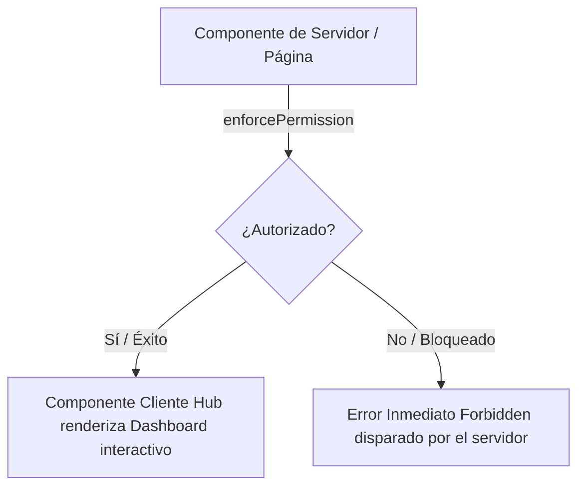

# Informe de Fases: 220 y 221 - Alineación de Arquitectura de Rutas y Permisos

## Introducción

Este documento detalla los avances logrados durante las **Fases 220** (Alineamiento del Sistema de Permisos) y **Fase 221** (Alineamiento de App Registry y Route Groups), marcando un hito crucial en la transición hacia la **Era 8** de la plataforma ABD RAG. Estas fases se enfocaron en estabilizar y asegurar la ruteabilidad y gobernanza del sistema, garantizando que la navegación fluida y la seguridad estén estrechamente unidas sin fisuras.

---

## FASE 220: Alineamiento del Sistema de Permisos (Guardian ABAC)

### El Reto

Anteriormente, la plataforma evaluaba si una página debía mostrarse o no usando una arquitectura lógica RBAC (Role-Based Access Control) incrustada en el código cliente. Esto representaba un riesgo para un modelo empresarial SaaS de Múltiples Inquilinos (*Multi-Tenant*), dado que un menú visual podía quedar desalineado de la capa estricta de base de datos —el motor de políticas **Guardian** basado en Atributos (ABAC). Existía el riesgo de que un usuario forzara el URL por carecer de protección sólida en servidor.

### Solución Implementada

1. **Protección Server-Side Robusta (React Server Components):**

   - Transicionamos todas las páginas sensibles bajo la capa administrativa (ej. Facturación, Registros de Auditoría Inmutables o Gobernanza de IA) para ser gestionadas exclusívamente por componentes de Servidor de React.
   - Integramos la primitiva directa `enforcePermission(resource, action)` en la cima del árbol de la jerarquía de cada página.
   - **Garantía Operativa**: Es perimetralmente imposible "engañar" al Frontend. Cualquier ingreso manual mediante URLs a páginas bloqueadas devuelve automáticamente en un error fatal `AppError` nativo desde Node.js (Servidor), antes de despachar bytes ocultos al ordenador del usuario.

   **Mapa de Recursos Segurizados:**

   | Página                        | Recurso de Permiso      | Acción    |
   | ------------------------------ | ----------------------- | ---------- |
   | Facturación (Billing)         | `admin:billing`       | `manage` |
   | Auditoría (Audit)             | `admin:audit`         | `read`   |
   | Seguridad (Security)           | `admin:security`      | `access` |
   | Organizaciones (Organizations) | `admin:organizations` | `manage` |
   | Configuración (Settings)      | `admin:settings`      | `manage` |
   | Gobernanza IA (AI Governance)  | `admin:ai:governance` | `manage` |
   | Prompts Magistrales            | `admin:prompts`       | `manage` |
   | Sysadmin (SuperAdmin)          | `admin:superadmin`    | `access` |
2. **Evaluación de Permisos en Lote (High-Performance Bulk Checks):**

   - **Antes:** Representar 15 opciones de un menú restringido exigía al backend cotejar uno por uno los permisos, lo cual resultaba ineficiente.
   - **Después:** El diseño del hook interno `useGuardian` incorporó el comando `canBulk()`. A la hora de inicializar una sesión, Next.js empaquetará la colección completa de permisos solicitados dentro del menú lateral (AppSidebar) dictaminando accesos mediante **una única petición consolidada**. Esto reduce exponencialmente la latencia inicial del "dashboard" manteniendo controles blindados.
3. **Cribado Dinámico de Interfaz UI:**

   - La barra de herramientas lateral (Sidebar) es reactiva e inteligente respecto a `canBulk()`. Cualquier opción que requiera privilegios sobre un recurso es dinámicamente escondida o revelada a tenor de los permisos de esa misma macro-evaluación Guardian. Un usuario visualiza la aplicación con total limpieza; jamás hallará pantallas sin salida.

### Extracción de Componentes de Cliente (Diagrama de Flujo)

Para mantener la barrera de Servidor sin sacrificar la interactividad del usuario final, empleamos un patrón en el cual el layout superior maneja la seguridad y expone vía propiedades la visual interactiva "Dashboard/Hub":

---

## FASE 221: App Registry & Route Group Realignment

### El Reto

En su estructura de **"Suite de Productos Multi-Industrial"**, la interfaz divide funcionalidades categorizadas por *Apps lógicas* o "Hubs" (Por ejemplo, el espacio "OPERATIONS", "TECHNICAL", "SUPPORT"). Originalmente, el AppRegistry forzaba en código declarar una y sola una ruta matriz (el `basePath` como clave única, e.g. `/technical`) para activar todo el estado visual y colores para dicha app.

**La realidad del sistema:** Múltiples ramas y árboles URL inconexos operan funcionalmente para la misma App. (Ejemplo: Al navegar por el visor de grafos Neo4j dentro de `/graphs`, el sistema no conseguía relacionarlo con la APP PRINCIPAL *TECHNICAL*, la cual estaba atada estáticamente solo a la ruta `/technical`).
Esta desalineación generaba desorientación de identidad gráfica y enlaces de retroceso quebrados en Next.js.

### Solución Implementada

1. **Pluralidad de Enrutamiento Multi-Path (Archipiélagos de Rutas):**

   - Refactorizamos la interfáz arquitectórica de la Suite (`AppDefinition`), deprecando por completo el rígido `basePath: string` e instituyendo arreglos de pertenencia `basePaths: string[]`.
   - Modificamos el Registro: Hoy, **CONFIG** absorbe `/admin/settings`, `/admin/permissions` y `/admin/billing`. **TECHNICAL** abarca tanto `/technical` subyacente, al igual que los subdominios de primer nivel `/entities` y `/graphs`. Ninguna ruta queda huérfana.
2. **Detección Determinista Basada en Especificidad (`getAppByPath`):**

   - Reimaginamos la función iteradora, permitiendo una correspondencia uno a muchos.
   - Algoritmo: Cuando se evalúa el *Pathname* que el usuario está operando, **el sistema recolecta y "aplana" absolutamente todas las posibilidades de todos los módulos. Posteriormente los ordena matemáticamente hacia abajo, confrontando las URL más largas (específicas) antes que las genéricas**. Cero colisiones en URIs profundas.
3. **Navegación Visual Coherente en Barra Lateral:**

   - Solucionamos los fallos de saltos funcionales. El selector nativo de Módulos (En la parte alta del Sidebar) en ruta a la APP requerirá a Next.js direccionar siempre estáticamente hacia `App.basePaths[0]` que hemos designado rigurosamente como su página *Index Hub* oficial ("Canonical route").
4. **Integración al Mapa Maestro ("API Contract"):**

   - Introdujimos exitosamente un rigor documental perpetuo en `map.md`. Hemos agregado a todas las 12 tablas funcionales de enrutamiento una columna declarada como **"API Contract"**.
   - Objetivo cumplido: Esto rastrea, visualiza y forja el mandato que la URL del Frontend tiene un gemelo espejo y legal dentro de la API Backend en `src/app/api`, haciendo de los desarrollos asíncronos en ABD RAG ejercicios más ordenados, auditables y libres de rutas subrepticias.

## Conclusión

La inyección combinada de validaciones férreas a nivel componente servidor (Servicios Seguros ABAC, Fase 220) emparejada simétricamente a una cohesión estructural Multi-ramificaciones y libre de colisiones (Fase 221) sitúan al Front-end de la Suite como un modelo pulcro. Hemos edificado seguridad sin fricción observable para el usuario y sentenciado la deuda técnica relacionada a URIs desalineados.

# Walkthrough - Fase 221: App Registry & Route Group Realignment

We have successfully completed Phase 221, resolving the discrepancies between our App Registry definitions and the actual Next.js route groups. The legacy `basePath` property has been refactored into a `basePaths` array, enabling a single Application module to claim ownership over multiple, disjoint route segments.

## Key Accomplishments

### 1. Multi-Path Support in App Registry

The

AppDefinition interface was migrated to use `basePaths: string[]`. This allows logical separation within the same App. For example:

* **TECHNICAL App** now officially owns both `/entities` and `/graphs`, plus `/technical`.
* **CONFIG App** now correctly claims `/admin/settings`, `/admin/permissions`, and `/admin/billing`.
* **SUPPORT App** captures the legacy routes `/support-ticket` and `/support-dashboard` alongside the canonical `/support`.

### 2. Specificity-Based Routing (

getAppByPath)

The core routing function

getAppByPath was refactored. Rather than a simple

find over a single path, it now:

1. Flattens all available `basePaths` from all apps.
2. Sorts them by character length (descending) to ensure that more specific paths match before broader ones.
3. Successfully connects complex UI interactions (like the

   CommandMenu) to the correct internal Application context.

### 3. Sidebar Selection Continuity

The

AppSidebar's App Switcher dropdown uses `app.basePaths[0]` as the primary/canonical entry point when a user clicks an app's icon, eliminating 404s to nonexistent hub routes while preserving the app's visual identity (colors, logos) across its extended sub-routes.

### 4. Architecture Contract Updated

The

map.md registry was augmented across all 12 major tables to include an **"API Contract"** column. This solidifies the relationship between our Frontend Hub Pages and their primary backend API endpoints, a crucial step for preventing future orphaned routes and maintaining strict Next.js API boundaries.

---

# Walkthrough - Fase 220: Permissions System Alignment

## Key Accomplishments

### 1. Robust Server-Side Enforcement

All critical administrative pages have been converted to  **React Server Components** . This allows us to use

enforcePermission directly in the rendering pipeline, preventing unauthorized users from accessing sensitive data even if they bypass the frontend UI.

| Page          | Permission Resource     | Action     |
| ------------- | ----------------------- | ---------- |
| Billing       | `admin:billing`       | `manage` |
| Audit         | `admin:audit`         | `read`   |
| Security      | `admin:security`      | `access` |
| Organizations | `admin:organizations` | `manage` |
| Settings      | `admin:settings`      | `manage` |
| AI Governance | `admin:ai:governance` | `manage` |
| Prompts       | `admin:prompts`       | `manage` |
| SuperAdmin    | `admin:superadmin`    | `access` |

### 2. High-Performance Bulk Checks

The

useGuardian hook was refactored to support bulk permission checks. Instead of making multiple API calls for each menu item in the sidebar, we now perform a single batch request, significantly reducing latency and server load.

<pre>

typescript

<svg xmlns="http://www.w3.org/2000/svg" width="24" height="24" viewBox="0 0 24 24" fill="none" stroke="currentColor" stroke-width="2" stroke-linecap="round" stroke-linejoin="round" aria-hidden="true" class="lucide lucide-copy h-3.5 w-3.5"><rect width="14" height="14" x="8" y="8" rx="2" ry="2"></rect><path d="M4 16c-1.1 0-2-.9-2-2V4c0-1.1.9-2 2-2h10c1.1 0 2 .9 2 2"></path></svg>

// Optimized Bulk Check

constcheckResults=awaitcanBulk(checks);

</pre>

### 3. Guardian-Filtered Navigation

The

AppSidebar now dynamically hides or shows menu items based on the user's explicit permissions in Guardian, ensuring the UI remains clean and secure.

## Technical Details

### Client Component Extraction

To maintain a server-side "Guard" while keeping high interactivity, we implemented a pattern where the main page file is a Server Component that handles security, and the body of the page is extracted into a "Client Hub":

<pre>

<svg id="mermaid-lgre4oux8" width="100%" xmlns="http://www.w3.org/2000/svg" class="flowchart" viewBox="0 0 486.9250183105469 409.75" aria-roledescription="flowchart-v2"><g><marker id="mermaid-lgre4oux8_flowchart-v2-pointEnd" class="marker flowchart-v2" viewBox="0 0 10 10" refX="5" refY="5" markerUnits="userSpaceOnUse" markerWidth="8" markerHeight="8" orient="auto"><path d="M 0 0 L 10 5 L 0 10 z" class="arrowMarkerPath"></path></marker><marker id="mermaid-lgre4oux8_flowchart-v2-pointStart" class="marker flowchart-v2" viewBox="0 0 10 10" refX="4.5" refY="5" markerUnits="userSpaceOnUse" markerWidth="8" markerHeight="8" orient="auto"><path d="M 0 5 L 10 10 L 10 0 z" class="arrowMarkerPath"></path></marker><marker id="mermaid-lgre4oux8_flowchart-v2-circleEnd" class="marker flowchart-v2" viewBox="0 0 10 10" refX="11" refY="5" markerUnits="userSpaceOnUse" markerWidth="11" markerHeight="11" orient="auto"><circle cx="5" cy="5" r="5" class="arrowMarkerPath"></circle></marker><marker id="mermaid-lgre4oux8_flowchart-v2-circleStart" class="marker flowchart-v2" viewBox="0 0 10 10" refX="-1" refY="5" markerUnits="userSpaceOnUse" markerWidth="11" markerHeight="11" orient="auto"><circle cx="5" cy="5" r="5" class="arrowMarkerPath"></circle></marker><marker id="mermaid-lgre4oux8_flowchart-v2-crossEnd" class="marker cross flowchart-v2" viewBox="0 0 11 11" refX="12" refY="5.2" markerUnits="userSpaceOnUse" markerWidth="11" markerHeight="11" orient="auto"><path d="M 1,1 l 9,9 M 10,1 l -9,9" class="arrowMarkerPath"></path></marker><marker id="mermaid-lgre4oux8_flowchart-v2-crossStart" class="marker cross flowchart-v2" viewBox="0 0 11 11" refX="-1" refY="5.2" markerUnits="userSpaceOnUse" markerWidth="11" markerHeight="11" orient="auto"><path d="M 1,1 l 9,9 M 10,1 l -9,9" class="arrowMarkerPath"></path></marker><g class="root"><g class="clusters"></g><g class="edgePaths"><path d="M249.194,62L249.194,68.167C249.194,74.333,249.194,86.667,249.194,98.333C249.194,110,249.194,121,249.194,126.5L249.194,132" id="L_A_B_0" class="edge-thickness-normal edge-pattern-solid edge-thickness-normal edge-pattern-solid flowchart-link" data-edge="true" data-et="edge" data-id="L_A_B_0" data-points="W3sieCI6MjQ5LjE5Mzc1MjI4ODgxODM2LCJ5Ijo2Mn0seyJ4IjoyNDkuMTkzNzUyMjg4ODE4MzYsInkiOjk5fSx7IngiOjI0OS4xOTM3NTIyODg4MTgzNiwieSI6MTM2fV0=" marker-end="url(#mermaid-lgre4oux8_flowchart-v2-pointEnd)"></path><path d="M211.204,235.76L195.83,248.258C180.457,260.757,149.71,285.753,134.336,303.752C118.963,321.75,118.963,332.75,118.963,338.25L118.963,343.75" id="L_B_C_0" class="edge-thickness-normal edge-pattern-solid edge-thickness-normal edge-pattern-solid flowchart-link" data-edge="true" data-et="edge" data-id="L_B_C_0" data-points="W3sieCI6MjExLjIwMzc0ODM1MDcwNDEzLCJ5IjoyMzUuNzU5OTk2MDYxODg1Nzd9LHsieCI6MTE4Ljk2MjUwMTUyNTg3ODksInkiOjMxMC43NX0seyJ4IjoxMTguOTYyNTAxNTI1ODc4OSwieSI6MzQ3Ljc1fV0=" marker-end="url(#mermaid-lgre4oux8_flowchart-v2-pointEnd)"></path><path d="M287.184,235.76L302.557,248.258C317.931,260.757,348.678,285.753,364.051,303.752C379.425,321.75,379.425,332.75,379.425,338.25L379.425,343.75" id="L_B_D_0" class="edge-thickness-normal edge-pattern-solid edge-thickness-normal edge-pattern-solid flowchart-link" data-edge="true" data-et="edge" data-id="L_B_D_0" data-points="W3sieCI6Mjg3LjE4Mzc1NjIyNjkzMjYsInkiOjIzNS43NTk5OTYwNjE4ODU3N30seyJ4IjozNzkuNDI1MDAzMDUxNzU3OCwieSI6MzEwLjc1fSx7IngiOjM3OS40MjUwMDMwNTE3NTc4LCJ5IjozNDcuNzV9XQ==" marker-end="url(#mermaid-lgre4oux8_flowchart-v2-pointEnd)"></path></g><g class="edgeLabels"><g class="edgeLabel" transform="translate(249.19375228881836, 99)"><g class="label" data-id="L_A_B_0" transform="translate(-65.32500457763672, -12)"><foreignObject width="130.65000915527344" height="24">enforcePermission</foreignObject></g></g><g class="edgeLabel" transform="translate(118.9625015258789, 310.75)"><g class="label" data-id="L_B_C_0" transform="translate(-11.324999809265137, -12)"><foreignObject width="22.649999618530273" height="24">Yes</foreignObject></g></g><g class="edgeLabel" transform="translate(379.4250030517578, 310.75)"><g class="label" data-id="L_B_D_0" transform="translate(-9.40000057220459, -12)"><foreignObject width="18.80000114440918" height="24">No</foreignObject></g></g></g><g class="nodes"><g class="node default" id="flowchart-A-0" transform="translate(249.19375228881836, 35)"><rect class="basic label-container" x="-114.95000457763672" y="-27" width="229.90000915527344" height="54"></rect><g class="label" transform="translate(-84.95000457763672, -12)"><rect></rect><foreignObject width="169.90000915527344" height="24">Page Server Component</foreignObject></g></g><g class="node default" id="flowchart-B-1" transform="translate(249.19375228881836, 204.875)"><polygon points="68.875,0 137.75,-68.875 68.875,-137.75 0,-68.875" class="label-container" transform="translate(-68.375, 68.875)"></polygon><g class="label" transform="translate(-41.875, -12)"><rect></rect><foreignObject width="83.75" height="24">Authorized?</foreignObject></g></g><g class="node default" id="flowchart-C-3" transform="translate(118.9625015258789, 374.75)"><rect class="basic label-container" x="-110.9625015258789" y="-27" width="221.9250030517578" height="54"></rect><g class="label" transform="translate(-80.9625015258789, -12)"><rect></rect><foreignObject width="161.9250030517578" height="24">Client Hub Component</foreignObject></g></g><g class="node default" id="flowchart-D-5" transform="translate(379.4250030517578, 374.75)"><rect class="basic label-container" x="-99.5" y="-27" width="199" height="54"></rect><g class="label" transform="translate(-69.5, -12)"><rect></rect><foreignObject width="139" height="24">Forbidden AppError</foreignObject></g></g></g></g></g></svg>

</pre>

### Route Registry Check

We updated

src/config/navigation.ts to include the necessary `resource` and `action` metadata for all critical routes, aligning the sidebar with the Guardian engine's policy definitions.

## Verification

### Security Validation

* Verified that unauthorized users are blocked at the route level.
* Confirmed that SuperAdmins retain full access via the hardcoded bypass.
* Validated that the Sidebar correctly reflects the user's permissions in real-time.

### Performance

* Bulk checks in the sidebar successfully reduced API calls from ~15 per session to 1 during navigation initialization.
* Server-side guards add minimal overhead (<50ms) to initial page loads.
