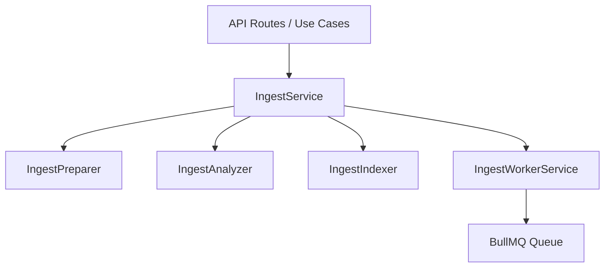

# 📄 Informe Funcional: Flujo de Ingesta ERA 6
**Versión:** 1.1 (ERA 6 Compatible)
**Fecha:** 20 de febrero de 2026 (Actualizado)
**Estado:** Documentación Técnica para Decisión de Negocio

---

## 1. Introducción
Este documento describe el comportamiento funcional del sistema de ingesta de documentos de la plataforma ABD RAG. El objetivo es aclarar cómo se procesan los datos según el modo seleccionado y por qué el usuario percibe comportamientos distintos entre ellas.

## 2. Puntos de Entrada y Roles
La ingesta se centraliza en el componente `UnifiedIngestModal`.

*   **¿Quién puede lanzar la ingesta?**
    *   **Administradores (ADMIN)**: Ingesta restringida a su propio **Tenant** (empresa).
    *   **SuperAdministradores (SUPER_ADMIN)**: Pueden elegir el **Alcance (Scope)**: Tenant local, Industria (Global para ascensores) o Global absoluto.
*   **Identidad del Proceso:**
    *   El sistema asocia el documento al `tenantId` del usuario que lo sube.
    *   En los logs técnicos, el proceso asíncrono aparece como realizado por `system_worker`, pero siempre hereda los permisos y el contexto del usuario original.

---

## 3. Los Dos Caminos de Ingesta

La plataforma divide la ingesta en dos filosofías de uso:

### 3.1 Modo Simplificado (Simple Mode)
Es el modo por defecto. Busca el "Time-to-First-Value" (TTFV) en menos de 60 segundos.

*   **Comportamiento Funcional:**
    *   **Auto-Configuración (`useSmartConfig`)**: El sistema analiza el nombre y tamaño del archivo antes de subirlo. 
        *   Si es un PDF pequeño (<2MB): Configura nivel **Bajo**.
        *   Si es un documento con palabras clave como "contrato" o "legal": Sube automáticamente a nivel **Alto** (Expert).
        *   Si es un PDF grande (>2MB): Configura nivel **Medio**.
    *   **Bypass de LLM en Fragmentación (Ahorro de Costes)**: Por defecto, si el nivel es **Bajo**, el sistema **NO usa Inteligencia Artificial** para fragmentar el texto. Simplemente lo trocea por caracteres (1500 caracteres, 200 de solapamiento).
    *   **⚠️ Hallazgo Crítico: Llamada LLM Oculta**: Aunque la fragmentación es mecánica, el sistema **SÍ llama a Gemini** para detectar la industria del documento (`DomainRouterService.detectIndustry`). Esto contradice el objetivo de "zero LLM" en modo simple. Ver **Sección 6, Mejora M-002**.
    *   **⚠️ Protección de Datos (PII)**: Actualmente, el sistema puede activar automáticamente la máscara de datos sensibles. Esto implica procesamiento adicional que **no debería ejecutarse** en modo simple sin confirmación del usuario. Ver **Sección 6, Mejora M-004**.
    *   **Funcionalidades Premium**: Están todas **DESACTIVADAS** (No hay visión de imágenes, no hay traducción, no hay extracción de grafos).

### 3.2 Modo Experto (Expert Mode)
Se activa mediante un interruptor (switch) en la interfaz. Permite control total sobre el pipeline.

*   **Niveles de Chunking (Fragmentación):**
    1.  **Bajo (Mecánico)**: Fragmentación fija por caracteres. Muy rápido, pero puede "cortar" frases por la mitad. **Sin coste de LLM.**
    2.  **Medio (Semántico)**: Divide el texto en oraciones, genera un **embedding** (vector numérico vía API de Gemini `text-embedding-004`) para cada una, y agrupa las oraciones por similitud de coseno. Cuando la similitud cae por debajo de un umbral (por defecto 0.75), corta el fragmento. **Consumo moderado de API de Embeddings** (una llamada por oración). No genera texto con LLM, pero sí consume tokens de la API.
    3.  **Alto (Agéntico)**: Un agente de IA lee el documento y decide cómo agrupar la información según el contenido. **Alto consumo de LLM.** → **Funcionalidad PREMIUM** (ligada a facturación y plan del cliente). Ver **Sección 6, Mejora M-006**.
*   **Funcionalidades Premium (Opcionales):**
    *   **Vision**: Analiza imágenes, planos y fotos dentro del PDF.
    *   **Auto-Traducción**: Si el documento está en otro idioma, lo traduce al español durante la ingesta.
    *   **Enriquecimiento Grafo (GraphRAG)**: Extrae entidades y relaciones para búsquedas más complejas.
    *   **Recuperación Contextual (Cognitive)**: Genera micro-resúmenes para cada fragmento, lo que mejora drásticamente la calidad de las respuestas posteriores.

---

## 4. ¿Por qué el sistema se comporta "diferente" de lo esperado?

Basado en la arquitectura actual, aquí están las razones de posibles inconsistencias:

1.  **Modo Simple != Calidad Máxima**: Al usar el modo simple con documentos pequeños, el sistema prioriza la velocidad y el ahorro. Si el usuario espera que la IA "entienda" diagramas en modo simple, fallará porque el **Análisis Visual (Vision)** está apagado.
2.  **El "Bypass" del Onboarding**: Durante el onboarding, el sistema fuerza una configuración optimizada para que el usuario reciba una respuesta rápida, lo que puede diferir de una ingesta manual donde el usuario no activa las opciones premium.
3.  **Aislamiento de Tenant**: Un documento subido como "Global" por un SuperAdmin será visible para todos, pero un documento subido por un Administrador normal solo existirá para su empresa. Si se busca un documento "perdido", es probable que el **Scope** no fuera el correcto.

## 5. Resumen Comparativo

| Característica | Simple (Bajo) | Experto (Medio) | Experto (Alto) |
| :--- | :--- | :--- | :--- |
| **Fragmentación** | Mecánica (caracteres) | Semántica (embeddings) | Agéntica (LLM decide) |
| **Uso de LLM Generativo** | ⚠️ 1 llamada oculta (Industria) | Ninguno directo | Intensivo |
| **Uso de API Embeddings** | Solo al indexar | Alto (1 por oración + indexar) | Solo al indexar |
| **Velocidad** | Instantánea (1-5s) | Moderada (10-30s) | Lenta (30s - 3min) |
| **Calidad RAG** | Estándar | Buena (cohesión temática) | Superior (Contextual) |
| **Determinismo** | ⚠️ Casi total (excepto industria) | Determinista (mismo embedding = mismo corte) | No determinista |
| **Imágenes/Tablas** | Ignoradas | Ignoradas (salvo activar Vision) | Analizadas (si se activa Vision) |
| **Costo** | Bajo (pero no zero) | Moderado | Alto (Premium) |
| **Configuración** | Automática | Manual | Manual detallada |

---

## 6. Mejoras Propuestas (Pendientes de Análisis)

Esta sección recoge mejoras identificadas durante la auditoría funcional. No están desarrolladas, solo enunciadas para su posterior análisis y priorización.

### M-001: Externalizar Palabras Clave de Auto-Configuración

**Estado Actual:** Las palabras clave que disparan el cambio automático de nivel en Modo Simple están hardcodeadas en `useSmartConfig.ts` ("contrato", "legal", etc.).

**Propuesta:** Mover a un sistema configurable con jerarquía de alcance:

| Nivel | Ejemplo | Gestión |
| :--- | :--- | :--- |
| **Global** | Palabras universales ("contrato", "anexo") | Solo SUPER_ADMIN |
| **Por Industria** | Palabras de ascensores ("cuadro", "motor", "foso") | SUPER_ADMIN |
| **Por Tenant** | Palabras específicas del cliente ("Schindler", "modelo X") | ADMIN del tenant |

**Opciones de Implementación (a evaluar):**
*   Base de datos con capa de caché (similar al patrón de `PromptService`).
*   Volcado periódico a archivo JSON para consumo rápido desde el frontend.
*   Modelo jerárquico similar a los Spaces (general → industria → tenant).

**Nota:** No se contempla nivel "por usuario" por ahora.

---

### M-002: Modo Simple = Zero LLM (Eliminar llamada oculta a Industria)

**Estado Actual:** Incluso en Modo Simple, el sistema llama a `DomainRouterService.detectIndustry()`, que internamente usa Gemini para clasificar el documento.

**Propuesta:**
*   En Modo Simple, la industria debe leerse del **contexto de la sesión** (el tenant ya tiene una industria asociada).
*   Si el usuario es **SUPER_ADMIN** (que puede gestionar múltiples industrias), se le debe preguntar explícitamente o permitir **reclasificar** el documento después de la ingesta.
*   Evaluar si es necesario un **"Modo Intermedio"** que permita auto-detección de industria sin activar fragmentación semántica completa.

**Objetivo:** Que el Modo Simple sea **100% determinista y offline** (sin llamadas externas a APIs de IA durante la fragmentación ni la clasificación).

---

### M-003: Revisar Dependencia de Embeddings en Nivel Medio (Semántico)

**Estado Actual:** El `SemanticChunker` llama a `generateEmbedding()` (API de Gemini `text-embedding-004`) para **cada oración** del documento. En un documento de 200 oraciones, son 200 llamadas a la API.

**Problema de Cuotas:** El LLM (Gemini) no solo limita por tokens, sino también por:
*   **Número de llamadas por minuto (RPM)**: 200 oraciones = potencialmente 200 requests en ráfaga.
*   **Tokens por minuto (TPM)**: Documentos grandes pueden agotar la cuota rápidamente.
*   **Timeouts**: Cada llamada individual puede fallar por latencia, multiplicando el riesgo.

**Hallazgo:** El proyecto **ya tiene BGE-M3 integrado** como modelo local (`@xenova/transformers` en `multilingual-service.ts`). Su uso está controlado por la variable de entorno `ENABLE_LOCAL_EMBEDDINGS`. **Es una alternativa real y viable** para generar embeddings sin depender de la API de Gemini.

**Propuesta:** Evaluar dos sub-niveles para Medio:

| Sub-Nivel | Fragmentación | Embeddings | Coste API | Determinismo |
| :--- | :--- | :--- | :--- | :--- |
| **Medio-Local** | Semántica (coseno) | BGE-M3 (local, offline) | Zero | Alto (modelo local = siempre igual) |
| **Medio-Cloud** | Semántica (coseno) | Gemini `text-embedding-004` | Moderado | Alto (pero sujeto a cuotas/latencia) |

**Puntos a Analizar:**
*   ¿La calidad de los embeddings de BGE-M3 es comparable a Gemini para esta tarea específica (agrupar oraciones por tema)?
*   ¿El rendimiento del modelo local es aceptable en Vercel Serverless (memoria, tiempos de carga)?
*   ¿Se expone al usuario como dos opciones o se auto-selecciona según disponibilidad del modelo local?

---

### M-004: PII en Modo Simple — No Auto-Activar

**Estado Actual:** El `useSmartConfig` puede activar `maskPii` automáticamente. La protección de datos PII implica procesamiento del texto (regex o LLM) que contradice el principio de "zero procesamiento extra" del modo simple.

**Propuesta:**
*   En Modo Simple, la máscara PII debe estar **DESACTIVADA por defecto**.
*   Si el sistema detecta que el documento podría contener datos sensibles, debe **advertir al usuario antes de lanzar** la ingesta, no activarlo silenciosamente.
*   El usuario decide: subir sin protección (rápido) o activar la protección (lo que podría cambiar el modo automáticamente al Intermedio).

**Objetivo:** Coherencia total con el principio de que Modo Simple = zero LLM, zero procesamiento extra.

---

### M-005: Diseñar un Modo Intermedio

**Estado Actual:** Solo existen dos modos: Simple (sin control, auto-configurado) y Experto (control total). Hay un salto funcional enorme entre ambos.

**Propuesta:** Crear un **Modo Intermedio** que:
*   Permita **auto-detección de industria** (vía LLM, a diferencia del Simple que lo lee del contexto).
*   Permita activar/desactivar PII con un toggle visible.
*   Use fragmentación **Simple (mecánica)** por defecto, pero permita cambiarla.
*   **No** active funcionalidades Premium (Vision, GraphRAG, Cognitive) — esas se reservan para Experto.
*   Sea la opción recomendada para usuarios con experiencia media que quieran un poco más de control sin la complejidad total del Experto.

**Nota:** Evaluar si este modo se integra como una opción dentro del modal actual o si requiere un flujo separado.

---

### M-006: Nivel Alto (Agéntico) = Funcionalidad Premium

**Estado Actual:** El nivel Alto está disponible para cualquier usuario que active el Modo Experto, sin restricciones.

**Propuesta:**
*   El nivel **Alto** debe estar **vinculado al plan de facturación** del tenant.
*   Solo los tenants con plan "Premium" (por definir) podrán activar este nivel.
*   Si un tenant sin plan Premium intenta usarlo, se le muestra un mensaje de upselling o se degrada automáticamente al nivel Medio.
*   La definición exacta de "Premium" (precio, límites, features incluidas) se determinará en una fase posterior.

**Alcance Premium (a definir):**
*   Chunking Alto (Agéntico)
*   Vision (Análisis visual de imágenes/planos)
*   Contexto Cognitivo (micro-resúmenes por fragmento)
*   GraphRAG (extracción de entidades y relaciones)

## 7. Estandarización y Consolidación Arquitectónica (Actualización v1.1)

Como parte de la mejora continua y deuda técnica (FASE 199), se ha realizado una reestructuración profunda del código de ingesta para garantizar escalabilidad y consistencia.

### 7.1 Estandarización de Campos (Naming)
*   **Campo `sizeBytes`**: Se ha estandarizado el nombre del campo que representa el tamaño del archivo de `fileSize` a `sizeBytes` en todo el monorepo (Schemas, servicios, scripts y logs de auditoría).
*   **Razón**: Consistencia con los estándares de la plataforma core y prevención de ambigüedades en el manejo de unidades.

### 7.2 Consolidación en `src/services/ingest/`
Se han movido los servicios orquestadores a un subdirectorio dedicado, eliminando servicios "huérfanos" en la raíz de `src/services/`:

*   `IngestService.ts`: Orquestador principal del pipeline RAG.
*   `IngestWorkerService.ts`: Gestión de colas asíncronas (BullMQ).
*   **Impacto**: Mejora la modularidad y facilita la navegación para desarrolladores.

### 7.3 Arquitectura de Componentes (v1.1)

### 7.4 Verificación de Integridad
*   **Build**: 100% limpio (0 errores de TypeScript).
*   **Auditoría**: Se han verificado las capas de seguridad (Guardian) y observabilidad para alinearlas con la nueva estructura.

---
*Este informe ha sido generado para la auditoría de la FASE 199. Última actualización: 20 de febrero de 2026 (v1.1).*
