# 🗺️ Application Map & Architecture Registry
**Last Audit:** 2026-02-20 (Phase 199 / Ingestion Integrity Hardening)
**Status:** Verified & Synchronized (Core Ingestion Pipeline Hardened & Orchestrated).

## 🧠 Site Structure (Mermaid)

```mermaid
graph TD
    %% Entry Points
    User((User)) --> Login["/login"]
    User --> Admin["/admin (Dashboard)"]
    User --> Technical["/entities (Technical Hub)"]

    %% Admin Hubs
    subgraph Admin_Panel [Admin Panel /admin]
        direction TB
        
        %% Core Hubs
        Admin --> UsersHub["/users (Users Hub)"]
        Admin --> SecurityHub["/security (Security Hub)"]
        Admin --> KnowledgeHub["/knowledge (Knowledge Hub)"]
        Admin --> AIHub["/ai (AI & Workflows)"]
        Admin --> OpsHub["/operations (Operations)"]
        Admin --> SettingsHub["/settings (Settings)"]
        Admin --> ReportsHub["/reports (Reports)"]
        Admin --> BillingHub["/billing (Billing)"]
        Admin --> OrgHub["/organizations (Organization)"]
        
        %% Security Details
        SecurityHub --> SecAudit["/security/audit"]
        SecurityHub --> SecSessions["/security/sessions"]
        
        %% Knowledge Details
        KnowledgeHub --> KExplorer["/knowledge/explorer"]
        KnowledgeHub --> KAssets["/knowledge/assets"]
        KnowledgeHub --> KSpaces["/knowledge/spaces"]
        KnowledgeHub --> KDocs["/knowledge/my-docs"]
        
        %% Users Details
        UsersHub --> UActive["/users/active"]
        UsersHub --> UPending["/users/pending"]
        
        %% AI Details
        AIHub --> AIPlayground["/ai/playground"]
        AIHub --> AIWorkflows["/ai/workflows"]
        AIHub --> AIRagQuality["/ai/rag-quality"]
        
        %% Operations Details
        OpsHub --> OpsStatus["/operations/status"]
        OpsHub --> OpsMaintenance["/operations/maintenance"]
        OpsHub --> OpsLogs["/operations/logs"]
        
        %% Vertical Modules
        Admin --> Compliance["/compliance"]
        Admin --> Workshop["/workshop/orders/new"]
    end
    
    %% Technical Panel
    subgraph Technical_Panel [Technical Mode]
        Technical --> Entities["/entities"]
        Technical --> Graphs["/graphs (Neo4j)"]
        Entities --> Validate["/entities/[id]/validar"]
    end
```

---

## 🛡️ Panel de Administración (Control Center)
Ubicación base: `/admin` (Protegido por Guardian V2)

### 🏠 Admin General (Unified Hubs)
| Ruta | Funcionalidad | Ultima Revisión |
|------|---------------|-----------------|
| `/admin` | **Dashboard Unificado (Hub)**: Punto de entrada por roles. | 2026-02-19 (Verified) |
| `/admin/tasks` | **Tasks Hub**: Gestión de tareas. | 2026-02-19 (Verified) |
| `/admin/security` | **Security Hub**: Dashboard de seguridad. | 2026-02-19 (Verified) |
| `/admin/security/audit` | **Audit Trail**: Registro inmutable. | 2026-02-19 (Verified) |
| `/admin/security/sessions` | **Active Sessions**: Gestión de sesiones de usuario. | 2026-02-19 (New) |
| `/admin/operations/maintenance` | Mantenimiento y corrección de datos. | 2026-02-19 (Verified) |
| `/admin/operations/status` | Estado de servicios e infraestructura. | 2026-02-19 (Verified) |
| `/admin/settings` | **Settings Hub**: Configuración centralizada. | 2026-02-19 (Verified) |
| `/admin/profile` | Perfil de usuario. | 2026-02-16 |
| `/admin/reports` | **Report Hub**: Dashboard de informes. | 2026-02-19 (Verified) |
| `/admin/reports/schedules` | Gestión de programación de informes. | 2026-02-19 (Verified) |
| `/admin/superadmin` | **Platform Dashboard**: Observabilidad global (SuperAdmin). | 2026-02-19 (Verified) |

### 🧠 Knowledge & RAG
| Ruta | Funcionalidad | Ultima Revisión |
|------|---------------|-----------------|
| `/admin/knowledge` | **Knowledge Hub**: Dashboard de conocimiento. | 2026-02-19 (Verified) |
| `/admin/knowledge/explorer` | **Neural Explorer**: Simulación RAG y búsqueda. | 2026-02-19 (Verified) |
| `/admin/knowledge/assets` | **Asset Management**: Gestión de activos. | 2026-02-19 (Verified) |
| `/admin/knowledge/my-docs` | **My Documents**: Gestión personal. | 2026-02-19 (Verified) |
| `/admin/knowledge/spaces` | **Spaces**: Configuración de espacios. | 2026-02-19 (Verified) |
| `/admin/knowledge-assets` | *Legacy Redirect (Active Route)* | 2026-02-19 (Verified) |

### 👮 Guardian & Users
| Ruta | Funcionalidad | Ultima Revisión |
|------|---------------|-----------------|
| `/admin/users` | **Users Hub**: Gestión de usuarios. | 2026-02-19 (Verified) |
| `/admin/users/active` | Usuarios activos. | 2026-02-19 (Verified) |
| `/admin/users/pending` | Invitaciones pendientes. | 2026-02-19 (Verified) |
| `/admin/permissions` | Matriz de permisos (Guardian). | 2026-02-17 |
| `/admin/permissions/groups` | Jerarquía de grupos. | 2026-02-17 |
| `/admin/permissions/simulator` | Sandbox de permisos. | 2026-02-17 |
| `/admin/document-types` | Tipos de documento. | 2026-02-19 (Verified) |

### ⚡ Automation Studio (AI)
| Ruta | Funcionalidad | Ultima Revisión |
|------|---------------|-----------------|
| `/admin/ai` | **AI Hub**: Dashboard de Inteligencia. | 2026-02-19 (Verified) |
| `/admin/ai/playground` | **Playground**: Experimentación RAG. | 2026-02-19 (Verified) |
| `/admin/ai/workflows` | **Workflows**: Editor de flujos. | 2026-02-19 (Verified) |
| `/admin/ai/rag-quality` | Calidad RAG. | 2026-02-19 (Verified) |
| `/admin/ai/predictive` | Mantenimiento Predictivo. | 2026-02-19 (Verified) |
| `/admin/checklist-configs` | Configuración de Checklists. | 2026-02-19 (Verified) |
| `/admin/checklist-configs/[id]` | Edición de Checklist. | 2026-02-19 (Verified) |
| `/api/admin/prompts/sync` | API: Sincronización de prompts maestros DB <-> Code. | 2026-02-20 (New) |

### 💰 Billing & Organizations
| Ruta | Funcionalidad | Ultima Revisión |
|------|---------------|-----------------|
| `/admin/billing` | **Billing Hub**. | 2026-02-19 (Verified) |
| `/admin/organizations` | **Organization Hub**. | 2026-02-19 (Verified) |
| `/admin/compliance` | Centro de Cumplimiento GDPR. | 2026-02-19 (Verified) |

### 🏭 Verticales & Taller
| Ruta | Funcionalidad | Ultima Revisión |
|------|---------------|-----------------|
| `/admin/workshop/orders/new` | Registro de pedidos de taller. | 2026-02-14 |
| `/admin/cases/[id]` | Detalle de Caso (Case Hero). | 2026-02-13 |

---

## 🛠️ Herramientas Técnicas (Expert Mode)
| Ruta | Funcionalidad | Ultima Revisión |
|------|---------------|-----------------|
| `/entities` | Dashboard de Entidades (Technical). | 2026-02-19 (Verified) |
| `/entities/[id]/validar` | Validación de Entidad. | 2026-02-19 (Verified) |
| `/graphs` | Visualizador de Grafo (Neo4j). | 2026-02-19 (Verified) |

---

## 🗑️ DEPRECATED & ARCHIVED
**Rutas eliminadas o renombradas (No existen en v5.0.0):**

*   `/technical/entities` -> Movido a `/entities` (Root level authenticated).
*   `/technical/graphs` -> Movido a `/graphs`.
*   `/admin/knowledge-base` -> Reemplazado por `/admin/knowledge` (Hub).
*   `/admin/security/logs` -> Movido a `/admin/operations/logs`.
*   `/admin/ingest/jobs` -> Movido a `/admin/operations/ingest`.
*   `/admin/spaces` -> Integrado en `/admin/knowledge/spaces`.
