# 🗺️ Application Map & Architecture Registry
**Last Audit:** 2026-02-23 (ERA 8 — Deep Route-by-Route Inspection)
**Status:** Full 101-route audit complete. All routes classified.
**Routes:** 101 `page.tsx` | 43 Canónicas | 30 No Documentadas (ahora sí) | 7 Redirects | 1 Placeholder | 1 DEPRECATED zombi

## 🧠 Site Structure (Mermaid)

```mermaid
graph TD
    User((User)) --> Login[Login Page]

    subgraph User_Experience["🌐 User Experience"]
        User --> Dashboard[Dashboard]
        User --> Search[RAG Search]
        User --> MyDocs[My Documents]
        User --> Profile[Profile]
        User --> UserSettings[Settings]
        User --> SpacesHub[Spaces Hub]
        User --> SupportClient[Support Center]

        SpacesHub --> SpCollections[Collections]
        SpacesHub --> SpPersonal[Personal Space]
        SpacesHub --> SpPlayground[Playground]
        SpacesHub --> SpQuickQA[Quick Q&A]

        SupportClient --> TicketNew[New Ticket]
        SupportClient --> TicketDetail["Ticket [id]"]
    end

    subgraph Admin_Panel["🏢 Admin Panel"]
        User --> Admin[Admin Dashboard Hub]
        Admin --> Superadmin[Platform Dashboard]

        subgraph Knowledge_RAG["🧠 Knowledge & RAG"]
            Admin --> KnowledgeHub[Knowledge Hub]
            KnowledgeHub --> KExplorer[Neural Explorer]
            KnowledgeHub --> KAssets[Asset Management]
            KnowledgeHub --> KMyDocs[My Docs - Admin]
            KnowledgeHub --> KSpaces[Space Config]
            Admin --> IntelTrends[Intelligence Trends]
        end

        subgraph AI_Automation["⚡ AI & Automation"]
            Admin --> AIHub[AI Hub]
            AIHub --> AIPlayground[AI Playground]
            AIHub --> AIWorkflows[Workflow Editor]
            AIHub --> AIRagQuality[RAG Quality]
            AIHub --> AIPredictive[Predictive Maint.]
            AIHub --> AIGovernance[AI Governance]
            Admin --> Prompts[Prompt Management]
            Admin --> Checklists[Checklist Configs]
            Admin --> Workflows["Workflows Editor"]
        end

        subgraph Security_Audit["🛡️ Security & Audit"]
            Admin --> SecurityHub[Security Hub]
            SecurityHub --> SecAudit[Security Audit Trail]
            SecurityHub --> SecSessions[Active Sessions]
            Admin --> AuditPage[Audit Log Explorer]
            AuditPage --> ConfigChanges[Config Changes]
        end

        subgraph Users_Perms["👮 Users & Permissions"]
            Admin --> UsersHub[Users Hub]
            UsersHub --> UsersActive[Active Users]
            UsersHub --> UsersPending[Pending]
            Admin --> Permissions[Permissions]
            Permissions --> PermGroups[Groups]
            Permissions --> PermSimulator[Simulator]
            Permissions --> PermMatrix[Matrix]
            Admin --> DocTypes[Document Types]
        end

        subgraph Billing_Orgs["💰 Billing & Organizations"]
            Admin --> BillingHub[Billing Hub]
            BillingHub --> Invoices[Invoices]
            BillingHub --> Contracts[Contracts]
            BillingHub --> BillingPlan[Plan Selector]
            BillingHub --> BillingUsage[Usage & ROI]
            Admin --> OrgHub[Organization Hub]
            OrgHub --> OrgGeneral[General Config]
            OrgHub --> OrgBranding[Branding]
            OrgHub --> OrgFeatures[Feature Toggles]
            OrgHub --> OrgBilling[Org Billing]
            Admin --> Compliance[Compliance GDPR]
        end

        subgraph Operations["⚙️ Operations"]
            Admin --> OpsHub[Operations Hub]
            OpsHub --> OpsStatus[Service Status]
            OpsHub --> OpsMaintenance[Maintenance]
            OpsHub --> OpsLogs[System Logs]
            OpsHub --> OpsIngest[Ingest Jobs]
            OpsHub --> OpsTrace[Trace Viewer]
            OpsHub --> OpsObserv[Observability]
        end

        subgraph Comms["📣 Communications"]
            Admin --> NotifHub[Notifications Hub]
            NotifHub --> NotifSettings[Settings]
            NotifHub --> NotifTemplates[Templates]
            NotifTemplates --> NotifTemplateType["Template Editor"]
        end

        subgraph Settings_Admin["⚙️ Settings"]
            Admin --> SettingsHub[Settings Hub]
            SettingsHub --> SetBranding["Branding (Placeholder)"]
            SettingsHub --> SetI18n[Translation Editor]
        end

        subgraph Reports_Analytics["📊 Reports & Analytics"]
            Admin --> ReportsHub[Reports Hub]
            ReportsHub --> RepSchedules[Report Schedules]
            Admin --> Analytics[Analytics Center]
            Admin --> APIDocs[API Reference]
            Admin --> APIKeys[Key Management]
        end

        subgraph Verticals_Workshop["🏭 Verticals"]
            Admin --> Tasks[Tasks Hub]
            Admin --> WorkflowTasks[Workflow Tasks]
            Admin --> Workshop["Workshop Orders"]
            Admin --> Cases["Case Detail"]
            Admin --> SupportDash[Support Dashboard - Staff]
        end
    end

    subgraph Technical_Panel["🛠️ Technical Panel"]
        User --> Technical[Technical Hub]
        Technical --> Entities[Entity Explorer]
        Entities --> Validate["Entity Validation"]
        Technical --> Graphs[Neo4j Graph]
    end

    subgraph Ops_Panel["🔧 Ops Portal"]
        User --> OpsReports[Ops Reports]
    end

    subgraph Vertical_Demos["🏢 Vertical Demos"]
        User --> RealEstate["Real Estate Demo"]
    end
```

---

## 🏢 Panel de Administración
Ubicación base: `/admin` (Protegido por Guardian)

### 🏠 Admin General
| Ruta | Funcionalidad | Estado | Líneas | Revisión |
|------|---------------|--------|--------|----------|
| `/admin` | **Dashboard Unificado (Hub)**: DashboardTabs compound component | ✅ | — | 2026-02-23 |
| `/admin/superadmin` | **Platform Dashboard**: Observabilidad global (SuperAdmin) | ✅ | 489 | 2026-02-23 |
| `/admin/tasks` | **Tasks Hub**: Gestión de tareas de negocio | ✅ | — | 2026-02-23 |
| `/admin/workflow-tasks` | **Workflow Ops**: Tareas de orquestación técnica | ✅ | — | 2026-02-23 |
| `/admin/profile` | Perfil de usuario administrativo | ✅ | — | 2026-02-23 |

### 🧠 Knowledge & RAG
| Ruta | Funcionalidad | Estado | Líneas | Revisión |
|------|---------------|--------|--------|----------|
| `/admin/knowledge` | **Knowledge Hub**: Dashboard de conocimiento | ✅ | — | 2026-02-23 |
| `/admin/knowledge/explorer` | **Neural Explorer**: Simulación RAG y búsqueda | ✅ | — | 2026-02-23 |
| `/admin/knowledge/assets` | **Asset Management**: Gestión de activos | ✅ | — | 2026-02-23 |
| `/admin/knowledge/my-docs` | **Knowledge > My Docs**: Documentos personales (admin) | ✅ | — | 2026-02-23 |
| `/admin/knowledge/spaces` | **Space Config**: Gestión administrativa de espacios | ✅ | — | 2026-02-23 |
| `/admin/my-documents` | **Personal Multi-tenant Store**: Almacén personal (admin) | ✅ | — | 2026-02-23 |
| `/admin/intelligence/trends` | **Trend Analysis**: Inteligencia industrial | ✅ | — | 2026-02-23 |

### ⚡ AI & Automation Studio
| Ruta | Funcionalidad | Estado | Líneas | Revisión |
|------|---------------|--------|--------|----------|
| `/admin/ai` | **AI Hub**: Dashboard de Inteligencia | ✅ | — | 2026-02-23 |
| `/admin/ai/playground` | **Playground**: Experimentación RAG | ✅ | — | 2026-02-23 |
| `/admin/ai/workflows` | **Workflows**: Editor de flujos | ✅ | — | 2026-02-23 |
| `/admin/ai/rag-quality` | **RAG Quality**: Métricas de calidad RAG | ✅ | — | 2026-02-23 |
| `/admin/ai/predictive` | **Predictive Maintenance**: Mantenimiento predictivo | ✅ | — | 2026-02-23 |
| `/admin/ai/governance` | **AI Governance**: Selección de modelos LLM, cuotas, PII masking | 🆕 | 361 | 2026-02-23 |
| `/admin/prompts` | **Prompt Management**: Gestión completa de prompts maestros | 🆕 | 486 | 2026-02-23 |
| `/admin/workflows` | **Workflows List**: Lista de workflows | 🆕 | — | 2026-02-23 |
| `/admin/workflows/[id]` | **Workflow Editor**: Editor individual de workflow | 🆕 | — | 2026-02-23 |
| `/admin/checklist-configs` | **Checklists**: Configuración de Checklists | ✅ | — | 2026-02-23 |
| `/admin/checklist-configs/[id]` | **Checklist Editor**: Edición de Checklist | ✅ | — | 2026-02-23 |
| `/admin/checklist-configs/new` | **New Checklist**: Crear checklist | 🆕 | — | 2026-02-23 |

### 🛡️ Security & Audit
| Ruta | Funcionalidad | Estado | Líneas | Revisión |
|------|---------------|--------|--------|----------|
| `/admin/security` | **Security Hub**: Dashboard de seguridad | ✅ | 123 | 2026-02-23 |
| `/admin/security/audit` | **Security Audit Trail**: Registro inmutable (security-focused) | ✅ | — | 2026-02-23 |
| `/admin/security/sessions` | **Active Sessions**: Gestión de sesiones concurrentes | ✅ | — | 2026-02-23 |
| `/admin/audit` | **Audit Log Explorer**: Explorador industrial de logs con filtros y métricas | 🆕 | 260 | 2026-02-23 |
| `/admin/audit/config-changes` | **Config Audit**: Auditoría SOC2 inmutable de cambios de configuración | 🆕 | 40 | 2026-02-23 |

> **Nota**: `/admin/audit` y `/admin/security/audit` son módulos DIFERENTES. `audit` = log explorer industrial con filtros. `security/audit` = trail inmutable de seguridad.

### 👮 Users & Permissions
| Ruta | Funcionalidad | Estado | Líneas | Revisión |
|------|---------------|--------|--------|----------|
| `/admin/users` | **Users Hub**: Gestión de usuarios | ✅ | — | 2026-02-23 |
| `/admin/users/active` | Usuarios activos | ✅ | — | 2026-02-23 |
| `/admin/users/pending` | Invitaciones pendientes | ✅ | — | 2026-02-23 |
| `/admin/permissions` | Matriz de permisos (Guardian) | ✅ | — | 2026-02-23 |
| `/admin/permissions/groups` | Jerarquía de grupos | ✅ | — | 2026-02-23 |
| `/admin/permissions/simulator` | Sandbox de permisos | ✅ | — | 2026-02-23 |
| `/admin/permissions/matrix` | Vista matricial de permisos | 🆕 | — | 2026-02-23 |
| `/admin/document-types` | Tipos de documento | ✅ | — | 2026-02-23 |

### 💰 Billing & Organizations
| Ruta | Funcionalidad | Estado | Líneas | Revisión |
|------|---------------|--------|--------|----------|
| `/admin/billing` | **Billing Hub**: Suscripciones y facturación | ✅ | — | 2026-02-23 |
| `/admin/billing/invoices` | Historial de facturas | ✅ | — | 2026-02-23 |
| `/admin/billing/contracts` | Gestión de contratos PDF | ✅ | — | 2026-02-23 |
| `/admin/billing/plan` | **Plan Selector**: Selector de plan de suscripción | 🆕 | 95 | 2026-02-23 |
| `/admin/billing/usage` | **Usage & ROI**: Métricas de uso, cuotas y ROI | 🆕 | 373 | 2026-02-23 |
| `/admin/organizations` | **Organization Hub**: Dashboard multitenant | ✅ | — | 2026-02-23 |
| `/admin/organizations/general` | Configuración básica del tenant | ✅ | — | 2026-02-23 |
| `/admin/organizations/branding` | Personalización visual (Logo/Colores) | ✅ | — | 2026-02-23 |
| `/admin/organizations/features` | Control de módulos activos por tenant | ✅ | — | 2026-02-23 |
| `/admin/organizations/billing` | Facturación por organización | 🆕 | — | 2026-02-23 |
| `/admin/compliance` | Centro de Cumplimiento GDPR / Auditoría | ✅ | — | 2026-02-23 |

### ⚙️ Operations
| Ruta | Funcionalidad | Estado | Líneas | Revisión |
|------|---------------|--------|--------|----------|
| `/admin/operations` | **Operations Hub**: Punto de entrada operaciones | ✅ | 137 | 2026-02-23 |
| `/admin/operations/status` | Estado de servicios e infraestructura | ✅ | — | 2026-02-23 |
| `/admin/operations/maintenance` | Mantenimiento y corrección de datos | ✅ | — | 2026-02-23 |
| `/admin/operations/logs` | **System Logs**: Logs del sistema (canónica) | ✅ | — | 2026-02-23 |
| `/admin/operations/ingest` | **Ingest Jobs**: Trabajos de ingesta (canónica) | ✅ | — | 2026-02-23 |
| `/admin/operations/trace` | **Trace Viewer**: Auditoría forense de decisiones IA | ✅ | — | 2026-02-23 |
| `/admin/operations/observability` | **Observability**: Observabilidad del sistema | 🆕 | — | 2026-02-23 |

### 📣 Communications
| Ruta | Funcionalidad | Estado | Líneas | Revisión |
|------|---------------|--------|--------|----------|
| `/admin/notifications` | **Communication Hub**: Plantillas y log de envíos | ✅ | — | 2026-02-23 |
| `/admin/notifications/settings` | Configuración de notificaciones | 🆕 | — | 2026-02-23 |
| `/admin/notifications/templates` | Lista de plantillas de notificación | 🆕 | — | 2026-02-23 |
| `/admin/notifications/templates/[type]` | Editor de plantilla por tipo | 🆕 | — | 2026-02-23 |

### ⚙️ Settings
| Ruta | Funcionalidad | Estado | Líneas | Revisión |
|------|---------------|--------|--------|----------|
| `/admin/settings` | **Settings Hub**: Configuración centralizada | ✅ | — | 2026-02-23 |
| `/admin/settings/branding` | **Branding** (Placeholder: "Próximamente") | 🏗️ | 20 | 2026-02-23 |
| `/admin/settings/i18n` | **Translation Editor**: Gestión maestra de traducciones | 🆕 | 317 | 2026-02-23 |

### 📊 Reports & Analytics
| Ruta | Funcionalidad | Estado | Líneas | Revisión |
|------|---------------|--------|--------|----------|
| `/admin/reports` | **Report Hub**: Dashboard de informes de negocio | ✅ | — | 2026-02-23 |
| `/admin/reports/schedules` | Programación de informes | 🆕 | — | 2026-02-23 |
| `/admin/analytics` | **Analytics Center**: Métricas de uso y adopción | ✅ | — | 2026-02-23 |
| `/admin/api-docs` | **API Reference**: Swagger/Doc interna | ✅ | — | 2026-02-23 |
| `/admin/api-keys` | **Key Management**: Tokens de integración | ✅ | — | 2026-02-23 |

### 🏭 Verticales, Taller & Soporte Admin
| Ruta | Funcionalidad | Estado | Líneas | Revisión |
|------|---------------|--------|--------|----------|
| `/admin/workshop/orders/new` | Registro de pedidos de taller | ✅ | — | 2026-02-23 |
| `/admin/cases/[id]` | Detalle de Caso (Case Hero). Sin hub page | ✅ | — | 2026-02-23 |
| `/admin/support` | *Admin Support Redirect* | ✅ | — | 2026-02-23 |

### 🔀 Redirects (Admin)
| Ruta | Destino | Notas |
|------|---------|-------|
| `/admin/logs` | → `/admin/operations/logs` | Legacy redirect |
| `/admin/ingest/jobs` | → `/admin/operations/ingest` | Legacy redirect |
| `/admin/knowledge-base` | → `/admin/knowledge` | Legacy redirect |
| `/admin/knowledge-assets` | → `/admin/knowledge/assets` | Legacy redirect |
| `/admin/rag-quality` | → `/admin/ai/rag-quality` | Legacy redirect |
| `/admin/spaces` | → `/admin/knowledge/spaces` | Legacy redirect |

---

## 🌐 User Experience (Non-Admin)
Rutas accesibles por usuarios autenticados sin rol de admin.

| Ruta | Funcionalidad | Estado | Líneas | Revisión |
|------|---------------|--------|--------|----------|
| `/dashboard` | **Dashboard**: Entry point por rol (DashboardDispatcher) | 🆕 | 9 | 2026-02-23 |
| `/search` | **RAG Search**: Búsqueda conversacional con ConversationalSearch | 🆕 | 53 | 2026-02-23 |
| `/my-documents` | **My Documents**: Almacén personal de documentos (user-facing) | 🆕 | 379 | 2026-02-23 |
| `/profile` | **Profile**: Perfil de usuario | 🆕 | — | 2026-02-23 |
| `/settings` | **Settings**: Configuración de usuario | 🆕 | — | 2026-02-23 |

### 🪐 Spaces
| Ruta | Funcionalidad | Estado | Líneas | Revisión |
|------|---------------|--------|--------|----------|
| `/spaces` | **Spaces Hub**: Navegación por espacios de usuario | ✅ | — | 2026-02-23 |
| `/spaces/collections` | Colecciones del usuario | 🆕 | — | 2026-02-23 |
| `/spaces/personal` | Espacio personal | 🆕 | — | 2026-02-23 |
| `/spaces/playground` | Playground de espacio | 🆕 | — | 2026-02-23 |
| `/spaces/quick-qa` | Preguntas rápidas | 🆕 | — | 2026-02-23 |

### 💬 Support (Client)
| Ruta | Funcionalidad | Estado | Líneas | Revisión |
|------|---------------|--------|--------|----------|
| `/support` | **Support Center (Client)**: Centro de ayuda y tickets | ✅ | — | 2026-02-23 |
| `/support/[id]` | Detalle de ticket | 🆕 | — | 2026-02-23 |
| `/support/nuevo` | Crear nuevo ticket | 🆕 | — | 2026-02-23 |
| `/support-dashboard` | **Support Hub (Staff)**: Gestión de soporte interno | ✅ | — | 2026-02-23 |

### 🔀 Redirects (User)
| Ruta | Destino | Notas |
|------|---------|-------|
| `/support-ticket` | → `/support/nuevo` | Legacy redirect |

---

## 🛠️ Technical Panel
| Ruta | Funcionalidad | Estado | Líneas | Revisión |
|------|---------------|--------|--------|----------|
| `/technical` | **Technical Hub**: Punto de entrada técnico | 🆕 | — | 2026-02-23 |
| `/entities` | **Entity Explorer**: Dashboard de Entidades | ✅ | — | 2026-02-23 |
| `/entities/[id]/validar` | Validación Técnica de Entidad | ✅ | — | 2026-02-23 |
| `/graphs` | **Neo4j Explorer**: Visualizador de Grafo | ✅ | — | 2026-02-23 |

## 🔧 Ops Portal
| Ruta | Funcionalidad | Estado | Líneas | Revisión |
|------|---------------|--------|--------|----------|
| `/ops/reports` | **Ops Reports**: Reportes operacionales | 🆕 | — | 2026-02-23 |

## 🏢 Vertical Demos
| Ruta | Funcionalidad | Estado | Líneas | Revisión |
|------|---------------|--------|--------|----------|
| `/real-estate` | **Real Estate Demo**: Property Twin con datos mock (Fase 85) | 🎭 | 120 | 2026-02-23 |

---

## 🔌 API Routes (Principales)
| Ruta | Funcionalidad | Revisión |
|------|---------------|----------|
| `/api/technical/*` | **Modular API**: RAG, Entities, Workflows | 2026-02-23 |
| `/api/support/*` | **Modular API**: Tickets, Support Knowledge | 2026-02-23 |
| `/api/ops/*` | **Modular API**: Logs, Audit, Health, ETA | 2026-02-23 |
| `/api/admin/prompts/sync` | Sincronización de prompts maestros DB ↔ Code | 2026-02-23 |
| `/api/admin/ai/governance` | Config LLM (GET/PATCH) | 2026-02-23 |
| `/api/admin/billing/usage` | Usage metrics & ROI | 2026-02-23 |
| `/api/admin/i18n/*` | Translation management | 2026-02-23 |
| `/api/admin/ingest/[id]/enrich` | Post-ingesta premium triggers | 2026-02-23 |

---

## ⚠️ Clusters de Duplicación Pendientes (ERA 8)

### 📄 "Mis Documentos" × 3
| Ruta | API | Contexto |
|------|-----|----------|
| `/admin/my-documents` | TBD | Admin-only |
| `/admin/knowledge/my-docs` | TBD | Bajo Knowledge Hub |
| `/my-documents` (379 líneas) | `/api/auth/knowledge-assets` | User-facing, hooks estándar |

### 💬 "Soporte" × 4 puntos de entrada
| Ruta | Rol | Datos |
|------|-----|-------|
| `/support` + sub-rutas | Client | Funcional |
| `/admin/support` | Admin | Redirect |
| `/support-dashboard` | Staff | **100% FAKE DATA** |
| `/support-ticket` | Legacy | Redirect → `/support/nuevo` |

### 🔍 "Audit / Logs" × 3
| Ruta | Propósito |
|------|-----------|
| `/admin/audit` (260 líneas) | Log explorer industrial, filtros, métricas |
| `/admin/security/audit` | Audit trail inmutable (security) |
| `/admin/operations/logs` | System logs operacionales |

---

## 🗑️ DEPRECATED & ARCHIVED
**Rutas eliminadas/renombradas. Solo existen como redirects:**

- `/admin/knowledge-base` → Redirect a `/admin/knowledge`
- `/admin/knowledge-assets` → Redirect a `/admin/knowledge/assets`
- `/admin/logs` → Redirect a `/admin/operations/logs`
- `/admin/ingest/jobs` → Redirect a `/admin/operations/ingest`
- `/admin/rag-quality` → Redirect a `/admin/ai/rag-quality`
- `/admin/spaces` → Redirect a `/admin/knowledge/spaces`
- `/support-ticket` → Redirect a `/support/nuevo`
- `/technical/entities` → Movido a `/entities`
- `/technical/graphs` → Movido a `/graphs`
- `/admin/security/logs` → Movido a `/admin/operations/logs`
- `/admin/intelligence` → Reemplazado por `/admin/ai` y `/admin/intelligence/trends`
- `/admin/billing/plan` → ⚠️ map.md lo declaraba deprecated pero es funcional (95 líneas, i18n OK). **Reclasificado como CANÓNICA.**
