# 🗺️ Application Map & Architecture Registry
**Last Audit:** 2026-02-23 (Phase 217 / Interaction Excellence & ERA-7 Support)
**Status:** Verified & Synchronized (CMD+K Nav, RAG Metrics, Mobile UX & Predictivity Standardized).

## 🧠 Site Structure (Mermaid)

```mermaid
graph TD
    User((User)) --> Login[Login Page]
    User --> Admin[Admin Dashboard Hub]
    User --> Technical[Technical Hub - Entities]
    User --> SupportHub[Support - Client]
    User --> SpacesHub[Spaces Hub]

    subgraph Admin_Panel
        Admin --> UsersHub[Users Hub]
        Admin --> SecurityHub[Security Hub]
        Admin --> KnowledgeHub[Knowledge Hub]
        Admin --> AIHub[AI and Workflows]
        Admin --> OpsHub[Operations]
        Admin --> SettingsHub[Settings]
        Admin --> ReportsHub[Reports]
        Admin --> BillingHub[Billing]
        Admin --> OrgHub[Organizations]
        Admin --> AnalyticsPage[Analytics Center]
        Admin --> NotificationsPage[Communications]

        SecurityHub --> SecAudit[Audit Trail]
        SecurityHub --> SecSessions[Active Sessions]

        KnowledgeHub --> KExplorer[Neural Explorer]
        KnowledgeHub --> KAssets[Asset Management]
        KnowledgeHub --> KSpaces[Space Config]
        KnowledgeHub --> KDocs[My Documents]

        AIHub --> AIPlayground[AI Playground]
        AIHub --> AIWorkflows[Workflow Editor]
        AIHub --> AIRagQuality[RAG Quality]
        AIHub --> AIPredictive[Predictive Maintenance]

        OpsHub --> OpsStatus[Service Status]
        OpsHub --> OpsMaintenance[Maintenance]
        OpsHub --> OpsLogs[System Logs]
        OpsHub --> OpsIngest[Ingest Jobs]
    end

    subgraph Support_Ecosystem
        SupportHub --> TicketNew[New Ticket]
        SupportHub --> TicketList[Ticket List]
        Admin --> SupportDash[Support Dashboard - Staff]
    end

    subgraph Technical_Panel
        Technical --> Entities[Entity Explorer]
        Technical --> Graphs[Neo4j Graph]
        Entities --> Validate[Entity Validation]
    end
```

---

## 🛡️ Panel de Administración (Control Center)
Ubicación base: `/admin` (Protegido por Guardian V2)

### 🏠 Admin General (Unified Hubs)
| Ruta | Funcionalidad | Ultima Revisión |
|------|---------------|-----------------|
| `/admin` | **Dashboard Unificado (Hub)**: Punto de entrada por roles. | 2026-02-19 (Verified) |
| `/admin/tasks` | **Tasks Hub**: Gestión de tareas de negocio. | 2026-02-23 (Updated) |
| `/admin/workflow-tasks` | **Workflow Ops**: Tareas de orquestación técnica. | 2026-02-23 (New) |
| `/admin/security` | **Security Hub**: Dashboard de seguridad. | 2026-02-19 (Verified) |
| `/admin/security/audit` | **Audit Trail**: Registro inmutable de seguridad. | 2026-02-19 (Verified) |
| `/admin/security/sessions` | **Active Sessions**: Gestión de sesiones concurrentes. | 2026-02-19 (New) |
| `/admin/analytics` | **Analytics Center**: Métricas de uso y adopción. | 2026-02-23 (New) |
| `/admin/notifications` | **Communication Hub**: Plantillas y log de envíos. | 2026-02-23 (New) |
| `/admin/operations/maintenance` | Mantenimiento y corrección de datos. | 2026-02-19 (Verified) |
| `/admin/operations/status` | Estado de servicios e infraestructura. | 2026-02-19 (Verified) |
| `/admin/operations/trace` | **Trace Viewer**: Auditoría forense de decisiones IA. | 2026-02-23 (New) |
| `/admin/settings` | **Settings Hub**: Configuración centralizada. | 2026-02-19 (Verified) |
| `/admin/profile` | Perfil de usuario administrativo. | 2026-02-16 |
| `/admin/reports` | **Report Hub**: Dashboard de informes de negocio. | 2026-02-19 (Verified) |
| `/admin/api-docs` | **API Reference**: Swagger/Doc interna. | 2026-02-23 (New) |
| `/admin/api-keys` | **Key Management**: Tokens de integración. | 2026-02-23 (New) |
| `/admin/superadmin` | **Platform Dashboard**: Observabilidad global (SuperAdmin). | 2026-02-19 (Verified) |

### 🧠 Knowledge & RAG
| Ruta | Funcionalidad | Ultima Revisión |
|------|---------------|-----------------|
| `/admin/knowledge` | **Knowledge Hub**: Dashboard de conocimiento. | 2026-02-19 (Verified) |
| `/admin/knowledge/explorer` | **Neural Explorer**: Simulación RAG y búsqueda. | 2026-02-19 (Verified) |
| `/admin/knowledge/assets` | **Asset Management**: Gestión de activos de conocimiento. | 2026-02-19 (Verified) |
| `/admin/knowledge/my-docs` | **Knowledge > My Docs**: Documentos asociados al hub. | 2026-02-19 (Verified) |
| `/admin/my-documents` | **Personal Multi-tenant Store**: Almacén personal. | 2026-02-23 (Updated) |
| `/admin/knowledge/spaces` | **Space Config**: Gestión administrativa de espacios. | 2026-02-19 (Verified) |
| `/spaces` | **Spaces Hub**: Navegación por espacios de usuario. | 2026-02-23 (New) |
| `/admin/knowledge-assets` | *Legacy Redirect (Active Route)* | 2026-02-19 (Verified) |
| `/admin/intelligence/trends` | **Trend analysis**: Inteligencia competitiva/industrial. | 2026-02-23 (New) |

### 👮 Guardian & Users
| Ruta | Funcionalidad | Ultima Revisión |
|------|---------------|-----------------|
| `/admin/users` | **Users Hub**: Gestión de usuarios. | 2026-02-19 (Verified) |
| `/admin/users/active` | Usuarios activos. | 2026-02-19 (Verified) |
| `/admin/users/pending` | Invitaciones pendientes. | 2026-02-19 (Verified) |
| `/admin/permissions` | Matriz de permisos (Guardian). | 2026-02-17 |
| `/admin/permissions/groups` | Jerarquía de grupos. | 2026-02-17 |
| `/admin/permissions/simulator` | Sandbox de permisos. | 2026-02-17 |
| `/admin/document-types` | Tipos de documento. | 2026-02-19 (Verified) |

### ⚡ Automation Studio (AI)
| Ruta | Funcionalidad | Ultima Revisión |
|------|---------------|-----------------|
| `/admin/ai` | **AI Hub**: Dashboard de Inteligencia. | 2026-02-19 (Verified) |
| `/admin/ai/playground` | **Playground**: Experimentación RAG. | 2026-02-19 (Verified) |
| `/admin/ai/workflows` | **Workflows**: Editor de flujos. | 2026-02-19 (Verified) |
| `/admin/ai/rag-quality` | Calidad RAG. | 2026-02-19 (Verified) |
| `/admin/ai/predictive` | Mantenimiento Predictivo. | 2026-02-19 (Verified) |
| `/admin/checklist-configs` | Configuración de Checklists. | 2026-02-19 (Verified) |
| `/admin/checklist-configs/[id]` | Edición de Checklist. | 2026-02-19 (Verified) |
| `/api/admin/prompts/sync` | API: Sincronización de prompts maestros DB <-> Code. | 2026-02-20 (New) |

### 💰 Billing & Organizations
| Ruta | Funcionalidad | Ultima Revisión |
|------|---------------|-----------------|
| `/admin/billing` | **Billing Hub**: Suscripciones y facturación. | 2026-02-19 (Verified) |
| `/admin/billing/invoices` | Historial de facturas. | 2026-02-23 (New) |
| `/admin/billing/contracts` | Gestión de contratos PDF. | 2026-02-23 (New) |
| `/admin/organizations` | **Organization Hub**: Dashboard multitenant. | 2026-02-19 (Verified) |
| `/admin/organizations/general` | Configuración básica del tenant. | 2026-02-23 (New) |
| `/admin/organizations/branding` | Personalización visual (Logo/Colores). | 2026-02-23 (New) |
| `/admin/organizations/features` | Control de módulos activos por tenant. | 2026-02-23 (New) |
| `/admin/compliance` | Centro de Cumplimiento GDPR / Auditoría. | 2026-02-19 (Verified) |

### 🏭 Verticales & Taller
| Ruta | Funcionalidad | Ultima Revisión |
|------|---------------|-----------------|
| `/admin/workshop/orders/new` | Registro de pedidos de taller. | 2026-02-14 |
| `/admin/cases/[id]` | Detalle de Caso (Case Hero). | 2026-02-13 |

---

## 🛠️ Herramientas Técnicas (Expert Mode)
| Ruta | Funcionalidad | Ultima Revisión |
|------|---------------|-----------------|
| `/entities` | Dashboard de Entidades (Technical Hub). | 2026-02-23 (Verified) |
| `/entities/[id]/validar` | Validación Técnica de Entidad. | 2026-02-19 (Verified) |
| `/graphs` | Visualizador de Grafo (Neo4j Explorer). | 2026-02-23 (Verified) |
| `/support` | **Support Center (Client)**: Centro de ayuda y tickets. | 2026-02-23 (New) |
| `/support-dashboard` | **Support Hub (Staff)**: Gestión de soporte interno. | 2026-02-23 (New) |
| `/admin/support` | *Admin Support Redirect* | 2026-02-23 (New) |
| `/api/technical/*` | **Modular API**: RAG, Entities, Workflows. | 2026-02-22 (Deployed) |
| `/api/support/*` | **Modular API**: Tickets, Support Knowledge. | 2026-02-22 (Deployed) |
| `/api/ops/*` | **Modular API**: Logs, Audit, Health, ETA. | 2026-02-23 (Updated) |
| `/api/admin/ingest/[id]/enrich` | **Enrichment API**: Post-ingesta premium triggers. | 2026-02-23 (New) |

---

## 🗑️ DEPRECATED & ARCHIVED
**Rutas eliminadas o renombradas (No existen en v5.0.0):**

*   `/technical/entities` -> Movido a `/entities` (Root level authenticated).
*   `/technical/graphs` -> Movido a `/graphs`.
*   `/admin/knowledge-base` -> Reemplazado por `/admin/knowledge` (Hub).
*   `/admin/security/logs` -> Movido a `/admin/operations/logs`.
*   `/admin/ingest/jobs` -> Movido a `/admin/operations/ingest`.
*   `/admin/spaces` -> Integrado en `/admin/knowledge/spaces` (Admin) y `/spaces` (User).
*   `/admin/billing/plan` -> Integrado en sub-secciones de `/admin/billing`.
*   `/admin/intelligence` -> Reemplazado por `/admin/ai` y `/admin/intelligence/trends`.
