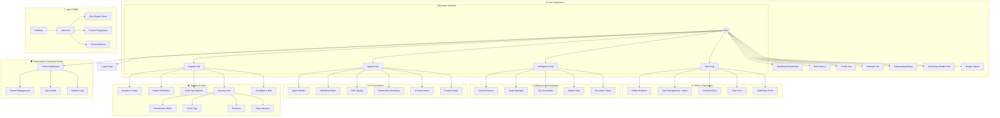

# 🗺️ Application Map & Architecture Registry
**Last Audit:** 2026-03-13 (Phase 450: Canonical Entities & Prompt Governance — COMPLETED ✅)
**Status:** Era 14/15 Clean Architecture Sweep. High maintainability verified. Canonical alignment finalized.
**Routes:** 127 `page.tsx` | 64 Canónicas | 54 Secundarias/Públicas | 12 Redirects | 0 GHOST

## 🧠 Site Structure (Mermaid)


```mermaid
graph TD
    User((User)) --> Login[Login Page]

    subgraph User_Experience["🌐 User Experience"]
        User --> Dashboard[Dashboard Dispatcher]
        User --> Search[RAG Search]
        User --> Profile[Profile Hub]
        User --> Settings[Settings Hub]
        User --> Onboarding[Onboarding Wizard]
        User --> TechView[Technician Mobile View]
        User --> SimpleSearch[Simple Search]
        
        subgraph Domains["🧩 Business Domains"]
            User --> HubWork[Work Hub]
            User --> HubIntel[Intelligence Hub]
            User --> HubAgents[Agents Hub]
            User --> HubInsights[Insights Hub]
        end
    end

    subgraph Work_Domain["⚙️ Work & Operations"]
        HubWork --> WOrders[Orders Explorer]
        HubWork --> WTasks[Task Management - /tasks]
        HubWork --> WChecklists[Checklist Exec]
        HubWork --> WCases[Case Hero]
        HubWork --> WWorkshop[Workshop Portal]
    end

    subgraph Intel_Domain["🧠 Intelligence & Knowledge"]
        HubIntel --> KExplorer[Neural Explorer]
        HubIntel --> KAssets[Asset Manager]
        HubIntel --> KMyDocs[My Documents]
        HubIntel --> KSpaces[Spaces Hub]
        HubIntel --> KDocTypes[Document Types]
    end

    subgraph Agents_Domain["⚡ AI & Automation"]
        HubAgents --> ABuilder[Agent Builder]
        HubAgents --> AWorkflows[Workflow Studio]
        HubAgents --> AQuality[RAG Quality]
        HubAgents --> AGolden[Golden Benchmarking]
        HubAgents --> AGovernance[AI Governance]
        HubAgents --> APrompts[Prompt Studio]
    end

    subgraph Insights_Domain["📊 Insights & Audit"]
        HubInsights --> IAnalytics[Analytics Center]
        HubInsights --> IReports[Report Schedules]
        HubInsights --> IAudit[Audit Log Explorer]
        HubInsights --> ISecurity[Security Hub]
        ISecurity --> ISecPerms[Permissions Matrix]
        ISecurity --> ISecAudit[Audit Logs]
        ISecurity --> ISecSessions[Sessions]
        ISecurity --> ISecLifecycle[Data Lifecycle]
        HubInsights --> ICompliance[Compliance Hub]
    end

    subgraph Help_Labs["🧪 Labs & R&D"]
        HubHelp --> HLabs[Labs Hub]
        HLabs --> HLabsRealEstate[Real Estate Demo]
        HLabs --> HLabsPrompts[Prompt Playground]
        HLabs --> HLabsMetrics[System Metrics]
    end

    subgraph SuperAdmin_Panel["🛡️ SuperAdmin Command Center"]
        User --> SAdminDash[Admin Dashboard]
        SAdminDash --> STenants[Tenant Management]
        SAdminDash --> SInfra[Infra Health]
        SAdminDash --> SLogs[System Logs]
    end
```
```

---
 
## 🧩 Dominios de Negocio (Business Hubs)
Ubicación base: Raíz `/` (Protegido por Guardian V3)

### ⚙️ Work & Operations (`/work`)
| Ruta | Funcionalidad | Dominio | Estado | Revisión |
|------|---------------|---------|--------|----------|
| `/work` | **Work Hub**: Centro de operaciones y pedidos | Operations | ✅ | 2026-03-08 |
| `/work/orders` | **Orders Explorer**: Gestión de pedidos de ascensor | Operations | ✅ | 2026-03-12 |
| `/tasks` | **Task Management**: Lista de tareas operativas (Canonical) | Operations | ✅ | 2026-03-12 |
| `/work/checklists` | **Checklist Execution**: Ejecución de reglas de negocio | Operations | ✅ | 2026-03-08 |
| `/work/checklists/new` | **New Checklist Config**: Configuración de reglas | Operations | ✅ | 2026-03-10 |
| `/work/checklists/[id]` | **Edit Checklist Config**: Editor de reglas dinámico | Operations | ✅ | 2026-03-10 |
| `/work/cases` | **Cases Hub**: Centro de gestión de contratos y expedientes | Operations | ✅ | 2026-03-10 |
| `/work/workshop` | Workshop Portal | Operations | [x] | 2026-03-10 |
| `/work/workshop/orders` | Workshop Orders List | Operations | [x] | 2026-03-10 |
| `/work/workshop/inventory` | Workshop Inventory | Operations | [x] | 2026-03-10 |
| `/work/workshop/protocols` | Workshop Protocols | Operations | [x] | 2026-03-10 |
| `/work/workshop/orders/new` | Create Workshop Order (IA) | Operations | [x] | 2026-03-10 |

### 🧠 Intelligence & Knowledge (`/intelligence`)
| Ruta | Funcionalidad | Dominio | Estado | Revisión |
|------|---------------|---------|--------|----------|
| `/intelligence` | **Intelligence Hub**: Dashboard de conocimiento | Knowledge | ✅ | 2026-03-08 |
| `/intelligence/explorer` | **Neural Explorer**: Simulación RAG profunda | Knowledge | ✅ | 2026-03-08 |
| `/intelligence/assets` | **Asset Manager**: Gestión de documentos y planos | Knowledge | ✅ | 2026-03-10 |
| `/intelligence/my-docs` | **My Documents**: Almacén personal de conocimiento | Knowledge | ✅ | 2026-03-08 |
| `/intelligence/spaces` | **Spaces Hub**: Gestión de espacios de trabajo | Knowledge | ✅ | 2026-03-10 |
| `/intelligence/document-types` | **DocTypes**: Configuración de taxonomía documental | Knowledge | ✅ | 2026-03-08 |
| `/intelligence/trends` | **Intelligence Trends**: Análisis predictivo industrial | Knowledge | ✅ | 2026-03-08 |

### ⚡ AI & Automation (`/agents`)
| Ruta | Funcionalidad | Dominio | Estado | Revisión |
|------|---------------|---------|--------|----------|
| `/agents` | **Agents Hub**: Central de orquestación IA | AI | ✅ | 2026-03-08 |
| `/agents/agents` | **Agent Builder**: Creación de agentes técnicos | AI | ✅ | 2026-03-08 |
| `/agents/workflows` | **Workflow Studio**: Editor de flujos agénticos | AI | ✅ | 2026-03-08 |
| `/agents/rag-quality` | **RAG Quality**: Métricas de alucinación y precisión | AI | ✅ | 2026-03-08 |
| `/agents/golden-sets` | **Golden Benchmarking**: Verificación científica de IA | AI | ✅ | 2026-03-08 |
| `/agents/governance` | **AI Governance**: Model Registry & Rate Limits | AI | ✅ | 2026-03-08 |
| `/agents/prompts` | **Prompt Studio**: Gestión de system prompts | AI | ✅ | 2026-03-08 |
| `/agents/playground` | **AI Playground**: Laboratorio de experimentación | AI | ✅ | 2026-03-10 |

### 📊 Insights & Audit (`/insights`)
| Ruta | Funcionalidad | Dominio | Estado | Revisión |
|------|---------------|---------|--------|----------|
| `/insights` | **Insights Hub**: Dashboard de analíticas y cumplimiento | Platform | ✅ | 2026-03-08 |
| `/insights/analytics` | **Analytics Center**: Dashboards de negocio | Platform | ✅ | 2026-03-08 |
| `/insights/reports` | **Report Schedules**: Programación de informes | Platform | ✅ | 2026-03-08 |
| `/insights/audit` | **Audit Log Explorer**: Trazabilidad SOC2 inmutable (Zero-Waterfall) | Security | ✅ | 2026-03-12 |
| `/insights/governance` | **Governance Hub**: Portal unificado SOC2 (Auditoría + Ops) | Platform | ✅ | 2026-03-12 |
| `/insights/security` | **Security Hub**: Estado de salud de seguridad | Security | ✅ | 2026-03-10 |
| `/insights/compliance` | **Compliance GDPR**: Centro de protección de datos | Compliance | ✅ | 2026-03-10 |
| `/insights/notifications` | **Comms History**: Log de notificaciones enviadas | Comms | ✅ | 2026-03-08 |


### ❓ Help & Support (`/help`)
| Ruta | Funcionalidad | Dominio | Estado | Revisión |
|------|---------------|---------|--------|----------|
| `/help/support` | **Support Portal**: Gestión de tickets y ayuda | Support | ✅ | 2026-03-09 |
| `/help/docs` | **Platform Docs**: Manuales y guía de usuario | Support | ✅ | 2026-03-11 |
| `/help/api` | **API Reference**: Documentación interactiva (Swagger) | Technical | ✅ | 2026-03-09 |
| `/help/labs` | **Labs & Demos**: Funcionalidades experimentales | R&D | ✅ | 2026-03-10 |
| `/real-estate` | **Real Estate**: Vertical de ejemplo inmobiliario | R&D | ✅ | 2026-03-10 |
| `/admin-dashboard/infra` | **System Metrics**: Monitor de infraestructura | Technical | ✅ | 2026-03-10 |
| `/onboarding` | **Onboarding Wizard**: Proceso guiado inicial | Platform | 🏗️ | 2026-03-12 |
| `/technician` | **Technician View**: Interfaz simplificada campo | Operations | ✅ | 2026-03-12 |
| `/simple-search` | **Simple Search**: Buscador minimalista | Knowledge | 🏗️ | 2026-03-12 |

---

## 🛡️ SuperAdmin Command Center (`/admin-dashboard`)
Ubicación base: `/admin-dashboard` (Protegido por SUPER_ADMIN role)

| Ruta | Funcionalidad | Dominio | Estado | Revisión |
|------|---------------|---------|--------|----------|
| `/admin-dashboard` | **Platform Dashboard**: Observabilidad global | Platform | ✅ | 2026-03-09 |
| `/admin-dashboard/tenants` | **Tenant Management**: Gestión de organizaciones | Platform | ✅ | 2026-03-09 |
| `/admin-dashboard/infra` | **Infra Health**: Estado de microservicios y DBs | Platform | ✅ | 2026-03-09 |
| `/admin-dashboard/logs` | **System Logs**: Registro de errores del sistema | Platform | ✅ | 2026-03-09 |
| `/api/admin/workflows/executions` | Workflow Executions API (Technical Audit) | Technical | ✅ | 2026-03-11 |
| `/api/admin/rag/quality/summary` | RAG Quality Metrics Summary | Technical | ✅ | 2026-03-11 |
| `/api/admin/logs` | System Logs Fetcher | Platform | ✅ | 2026-03-12 |
| `/api/admin/proactive-health` | Proactive Health & Anomalies API | Technical | ✅ | 2026-03-12 |
| `/api/governance/sgsi-evidence` | SGSI Evidence & PDF Export API | Compliance | ✅ | 2026-03-12 |
| `/api/health/deep` | Deep Infrastructure Health | Security | ✅ | 2026-03-11 |

---

## ⚙️ Settings Hub (`/settings`)
Ubicación base: `/settings` (Unified Profiles & System Config)

| Ruta | Funcionalidad | Dominio | Estado | Revisión |
|------|---------------|---------|--------|----------|
| `/settings` | **Settings Hub**: Panel unificado de configuración | Platform | ✅ | 2026-03-10 |
| `/settings/system` | **System Hub**: Panel de configuración técnica y gobernanza | Technical | ✅ | 2026-03-10 |
| `/settings/system/i18n` | **i18n Manager**: Gestión de traducciones dinámicas | Technical | ✅ | 2026-03-11 |
| `/settings/system/operations` | **Operations Hub**: Gestión de colas y procesos | Technical | ✅ | 2026-03-11 |
| `/settings/profile` | **My Profile**: Datos del usuario y preferencias | Personal | ✅ | 2026-03-10 |
| `/settings/organization` | **Org Settings**: Branding y configuración de tenant | Organizations | ✅ | 2026-03-10 |
| `/settings/users` | **User Management**: Gestión de accesos e invitaciones | Users | ✅ | 2026-03-10 |
| `/settings/permissions` | **Permission Matrix**: Configuración Guardian V3 | Security | ✅ | 2026-03-10 |
| `/settings/billing` | **Billing & ROI**: Suscripciones y facturas | Billing | ✅ | 2026-03-10 |
| `/settings/billing/config` | **Billing Config**: Configuración de pasarela | Billing | ✅ | 2026-03-10 |
| `/settings/api-keys` | **API Keys**: Gestión de tokens de integración | Platform | ✅ | 2026-03-08 |
| `/settings/notifications` | **Notif Config**: Canales y preferencias de alertas | Comms | ✅ | 2026-03-08 |

---

## 🔀 Redirects & Legacy Registry
| Ruta Legacy | Destino Nuevo | Notas |
|-------------|---------------|-------|
| `/admin` | `/admin-dashboard` | Redirección de rol SUPER_ADMIN |
| `/admin/ai` | `/agents` | Migración de dominio IA |
| `/admin/knowledge` | `/intelligence` | Migración de dominio RAG |
| `/admin/settings` | `/settings` | Unificación de configuración |
| `/admin/audit` | `/insights/audit` | Unificación de visibilidad |
| `/admin/reports` | `/insights/reports` | Unificación de visibilidad |
| `/admin/notifications` | `/insights/notifications`| Visibilidad de logs |
| `/admin/profile` | `/settings/profile` | Perfil de usuario |
| `/entities` | `/work/orders` | Reubicación por valor de negocio (Canonical: `orders`) |
| `/technical/entities` | `/work/orders` | Reubicación por valor de negocio (Canonical: `orders`) |
| `/admin/tasks` | `/work/tasks_legacy` | Reubicación de operaciones |
| `/admin/workshop` | `/work/workshop` | Reubicación de operaciones |
| `/admin/cases` | `/work/cases` | Reubicación de operaciones |

---

## 🌐 Public & Landing Pages
Rutas accesibles sin autenticación.

| Ruta | Funcionalidad | Dominio | Estado | Revisión |
|------|---------------|---------|--------|----------|
| `/` | **Landing Page**: Puerta de entrada principal | Platform | ✅ | 2026-03-08 |
| `/about` | Información sobre la plataforma | Marketing | ✅ | 2026-03-08 |
| `/accessibility` | Declaración de accesibilidad | Compliance | ✅ | 2026-03-11 |
| `/contact` | Formulario de contacto | Marketing | ✅ | 2026-03-08 |
| `/pricing` | Planes y precios | Billing | ✅ | 2026-03-08 |
| `/privacy` | Política de privacidad | Compliance | ✅ | 2026-03-08 |
| `/terms` | Términos y condiciones | Compliance | ✅ | 2026-03-11 |
| `/sandbox` | Área de pruebas pública | R&D | ✅ | 2026-03-08 |
| `/features/*` | Páginas de características (Audit, Compliance, etc.) | Marketing | ✅ | 2026-03-08 |
| `/auth/*` | Flujos de autenticación (Login, Signup, Magic Link) | Auth | ✅ | 2026-03-08 |
| `/architecture` | Vista pública de arquitectura (Internal) | Technical | ✅ | 2026-03-08 |

---

## 🌐 User Experience (Standard Routes)
Rutas accesibles por usuarios autenticados.

| Ruta | Funcionalidad | Dominio | Estado | Revisión |
|------|---------------|---------|--------|----------|
| `/dashboard` | **Dashboard Dispatcher**: Redirección por rol | Platform | ✅ | 2026-03-08 |
| `/search` | **RAG Search**: Búsqueda conversacional | Knowledge | ✅ | 2026-03-08 |
| `/intelligence/my-docs` | **My Documents**: Almacén personal (Canonical) | Knowledge | ✅ | 2026-03-08 |
| `/settings/profile` | **Profile**: Perfil de usuario (Canonical) | Personal | ✅ | 2026-03-08 |
| `/settings` | **Settings**: Configuración unificada | Platform | ✅ | 2026-03-08 |

---

## 🗑️ DEPRECATED & ARCHIVED
**Rutas eliminadas/renombradas. Solo existen como redirects permanentes:**

### 🚨 Legacy Admin (Era 8-10)
- `/admin` → `/admin-dashboard` (SuperAdmin)
- `/admin/ai/*` → `/agents/*`
- `/admin/knowledge/*` → `/intelligence/*`
- `/admin/settings/*` → `/settings/*`
- `/admin/audit` → `/insights/audit`
- `/admin/reports` → `/insights/reports`
- `/admin/notifications` → `/insights/notifications`
- `/admin/profile` → `/settings/profile`
- `/admin/tasks` → `/tasks` (Unified)
- `/work/tasks_legacy` → `/tasks` (Deleted)
- `/work/tasks_alt` → `/tasks` (Deleted)
- `/admin/workshop` → `/work/workshop`
- `/admin/cases` → `/work/cases`

### 📉 Legacy Features
- `/entities` → `/work/orders`
- `/technical/entities` → `/work/orders`
- `/admin/logs` → `/admin-dashboard/logs` (SI es SuperAdmin) o `/insights/audit`
- `/admin/knowledge-base` → `/intelligence`
- `/admin/spaces` → `/intelligence/spaces_legacy` (Fase de transición)
- `/support-ticket` → `/support/new`
- `/support-dashboard` → Eliminado en FASE 286.
- `/admin/intelligence` → Reemplazado por `/agents` y `/intelligence`.

---
**Last Audit Date:** 2026-03-13
**Auditor:** ABD Platform Architect (Phase 450)
**Next Scheduled Audit:** VIWS 2028 Initiation.
